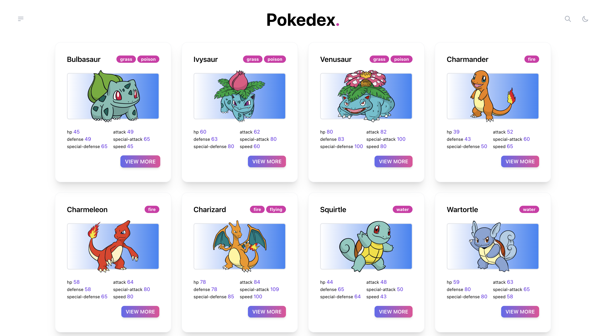
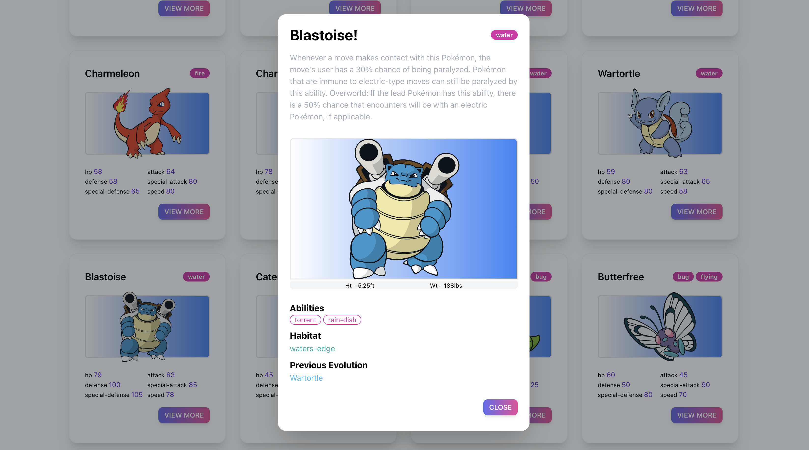
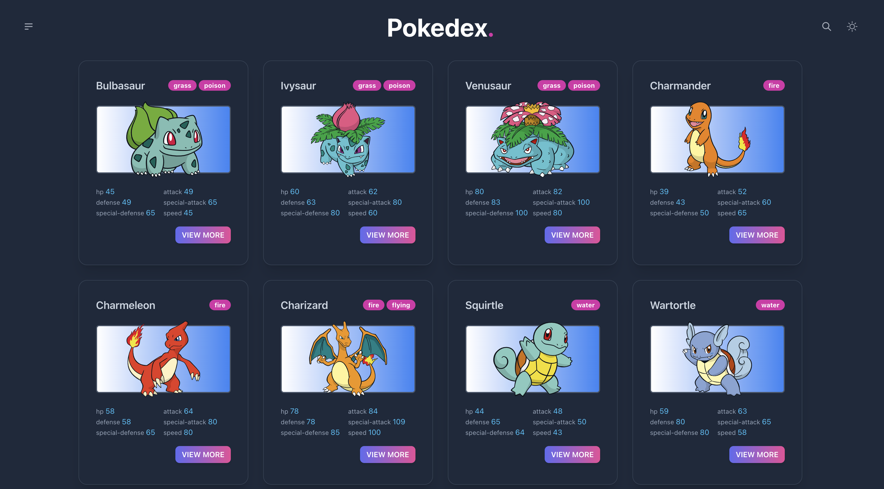
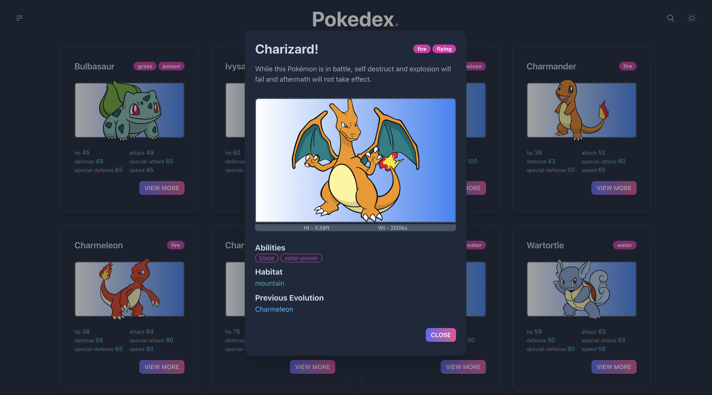
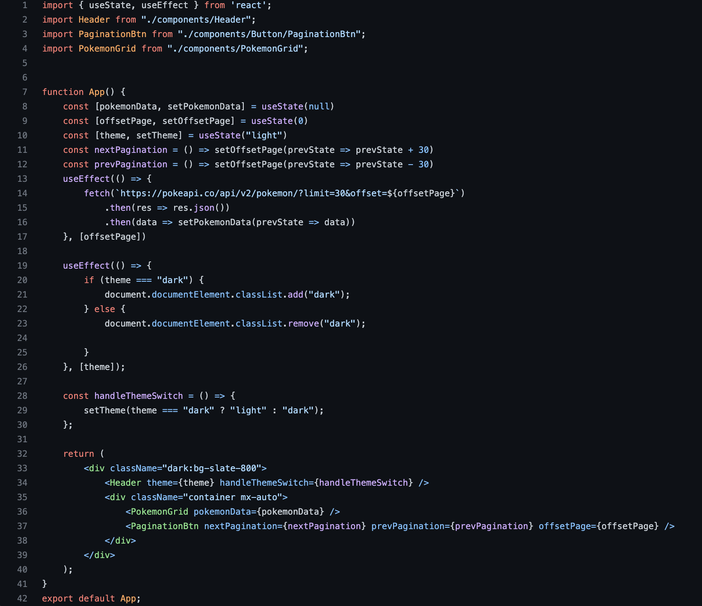

# React Pokédex
Is a React application that is styled with Tailwindcss and consumes data from the [PokeAPI](https://pokeapi.co/) and displays it to users in a pokédex fashion. Each Pokédex card allows users to view some extra information about each pokémon.

*Light Mode*

*Dark Mode*

## Features
- Light and Dark Mode
- Page counter
- Paginated list of 30 Pokédex cards per page. Clicking on the next page loads and displays the next 30 Pokédex. Similarly, clicking on the previous page loads back in and displays the previous 30 Pokédex.

  - Conditional rendering "Previous" button if user is on page 1.
- Fetch and show all Pokédex in a list card view. Each Pokédex card should include
    - Icon
    - ID
    - Name
    - Stats
    - Types
    - View More button
- Clicking the `View More` button brings a modal with extra details about the Pokédex as shown below:
    - Abilities
    - Description
    - Previous evolution | Conditional rendering if null.
    - Habitat
    - Height
    - Weight

## React concepts implemented

- Components
- State management
- props
- Use Effect
- conditional rendering
- mapping through data

## App.js code snapshot

### To view code for the `components` that were built, click [here](https://github.com/JustinWelsh/Pokedex-react/tree/main/frontend/src/components)

### then click the *name* of the component you'd like to view, or feel free to navigate the repo :)
